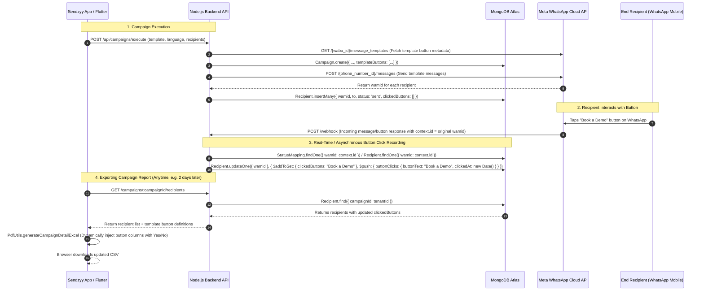

# Detailed Specification & Prompt: Dynamic Template Button Click Tracking & Dynamic CSV/Excel Campaign Reports

## 1. Feature Overview & Objectives
Sendzyy allows businesses to broadcast WhatsApp campaigns using approved Meta Message Templates. Many templates include interactive and Call-To-Action (CTA) buttons (e.g., Quick Reply buttons like *"Book a Demo"*, Phone Call buttons like *"Call Us"*, or URL buttons like *"Visit Website"*).

When a user downloads a **Campaign Detail CSV/Excel Report**, the report must:
1. **Dynamically identify all buttons** configured in the specific campaign's template (whether 1, 2, 3, or more buttons).
2. **Generate dedicated columns for each button** in the CSV/Excel recipient breakdown (e.g., `Book a Demo`, `Dharmik Thakkar`, `Sendzyy.com`).
3. **Display a per-recipient click status** in each button column:
   - `"Yes"` if the recipient clicked/responded to that button.
   - `"No"` if the recipient did not click that button.
4. **Continuously & asynchronously update**: If a contact clicks a button hours, days, or weeks after the campaign dispatch has finished, the event must be recorded against the recipient. Downloading the campaign report anytime in the future must reflect the latest real-time button click data.
5. **Fix Excel Phone Number Formatting**: Prevent Excel from turning 10-12 digit phone numbers into scientific notation (e.g., `5.56E+09` or `9.83E+09`).

---

## 2. Technical Architecture & Data Flow



---

## 3. Database Schema Changes

### 3.1 `recipientSchema` (`backend/server.js`)
Add fields to store button interactions:
```javascript
const recipientSchema = new mongoose.Schema({
    tenantId: String,
    campaignId: String,
    wamid: { type: String, unique: true },
    to: String,
    name: { type: String, default: null },
    status: { type: String, default: 'sent' },
    sentAt: String,
    deliveredAt: String,
    readAt: String,
    failedAt: String,
    phaseNumber: { type: Number, default: null },
    deliveryTimestamp: { type: Date, default: null },
    retryHistory: [{
        phaseNumber: Number,
        attemptedAt: Date,
        status: String
    }],
    // ── Button Interaction Tracking ──
    clickedButtons: { type: [String], default: [] }, // Array of clicked button texts, e.g. ["Book a Demo"]
    buttonClicks: [{
        buttonText: { type: String, required: true },
        buttonType: { type: String, default: 'QUICK_REPLY' }, // 'QUICK_REPLY' | 'PHONE_NUMBER' | 'URL' | 'INTERACTIVE'
        buttonId: { type: String, default: null },
        clickedAt: { type: Date, default: Date.now },
        rawPayload: { type: mongoose.Schema.Types.Mixed, default: null }
    }]
});
```

### 3.2 `campaignSchema` (`backend/server.js`)
Store the snapshot of buttons present in the template at dispatch time:
```javascript
const campaignSchema = new mongoose.Schema({
    tenantId: { type: String, required: true },
    id: { type: String, required: true },
    template: String,
    timestamp: { type: Date, default: Date.now },
    dispatchedAt: { type: Date, default: null },
    totalCount: { type: Number, default: 0 },
    successCount: { type: Number, default: 0 },
    failureCount: { type: Number, default: 0 },
    deliveredCount: { type: Number, default: 0 },
    readCount: { type: Number, default: 0 },
    // ── Template Buttons Snapshot ──
    templateButtons: [{
        text: { type: String, required: true },
        type: { type: String, default: 'QUICK_REPLY' }, // 'QUICK_REPLY' | 'PHONE_NUMBER' | 'URL'
        url: { type: String, default: null },
        phoneNumber: { type: String, default: null },
        index: { type: Number, default: 0 }
    }],
    // ... retryConfig, status, currentPhase, phaseStats
}, { timestamps: true });
```

---

## 4. Webhook Ingestion & Real-Time Button Event Processing

In `app.post('/webhook')` (`backend/server.js`):
When Meta receives a user interaction, it triggers a webhook with one of several payloads:

1. **Quick Reply Button (`msgType === 'button'`)**:
   ```json
   {
     "from": "919409563238",
     "id": "wamid.HBg...",
     "type": "button",
     "button": {
       "text": "Book a Demo",
       "payload": "payload_string"
     },
     "context": {
       "from": "918160601028",
       "id": "wamid.ORIGINAL_CAMPAIGN_WAMID"
     }
   }
   ```

2. **Interactive Button Reply (`msgType === 'interactive'` & `interactive.type === 'button_reply'`)**:
   ```json
   {
     "from": "919409563238",
     "id": "wamid.HBg...",
     "type": "interactive",
     "interactive": {
       "type": "button_reply",
       "button_reply": {
         "id": "btn_1",
         "title": "Book a Demo"
       }
     },
     "context": {
       "from": "918160601028",
       "id": "wamid.ORIGINAL_CAMPAIGN_WAMID"
     }
   }
   ```

3. **Text Match Fallback (`msgType === 'text'`)**:
   If a user replies with the exact text of a template button (e.g. replying `"Book a Demo"` or `"DEMO"`), and context links to the campaign or recent message from that tenant.

### Webhook Matching & Updating Logic:
```javascript
async function recordRecipientButtonClick(tenantId, from, buttonText, buttonType, buttonId, contextWamid, rawPayload) {
    let recipient = null;

    // Strategy A: Match by contextWamid (most accurate — links directly to original message wamid)
    if (contextWamid) {
        recipient = await Recipient.findOne({ wamid: contextWamid });
    }

    // Strategy B: Match via StatusMapping wamid
    if (!recipient && contextWamid) {
        const mapping = await StatusMapping.findOne({ wamid: contextWamid });
        if (mapping?.campaignId) {
            recipient = await Recipient.findOne({ campaignId: mapping.campaignId, to: from });
        }
    }

    // Strategy C: Fallback to most recent campaign sent to this phone number
    if (!recipient && from) {
        recipient = await Recipient.findOne({ tenantId, to: from }).sort({ _id: -1 });
    }

    if (recipient) {
        await Recipient.updateOne(
            { _id: recipient._id },
            {
                $addToSet: { clickedButtons: buttonText },
                $push: {
                    buttonClicks: {
                        buttonText,
                        buttonType: buttonType || 'QUICK_REPLY',
                        buttonId: buttonId || null,
                        clickedAt: new Date(),
                        rawPayload: rawPayload || null
                    }
                }
            }
        );
        console.log(`[Webhook] Recorded button click "${buttonText}" for recipient ${recipient.to} in campaign ${recipient.campaignId}`);
    }
}
```

---

## 5. API Endpoints

### 5.1 `GET /campaigns/:campaignId/recipients`
Updated to return:
1. `recipients`: Array of recipient documents with `clickedButtons` and `buttonClicks`.
2. `templateButtons`: List of buttons associated with the campaign (from `campaign.templateButtons` or fetched from Meta template definition).

Response shape:
```json
{
  "template": "acacc",
  "templateButtons": [
    { "text": "Book a Demo", "type": "QUICK_REPLY" },
    { "text": "Dharmik Thakkar", "type": "PHONE_NUMBER" },
    { "text": "Sendzyy.com", "type": "URL" }
  ],
  "recipients": [
    {
      "name": "Anna Hard",
      "to": "919409563238",
      "status": "delivered",
      "sentAt": "2026-08-21T17:33:00.000Z",
      "deliveredAt": "2026-08-21T17:33:10.000Z",
      "readAt": null,
      "failedAt": null,
      "clickedButtons": ["Book a Demo"],
      "buttonClicks": [
        {
          "buttonText": "Book a Demo",
          "buttonType": "QUICK_REPLY",
          "clickedAt": "2026-08-22T10:15:00.000Z"
        }
      ]
    }
  ]
}
```
*(Maintains backward compatibility: if the client expects a raw array, it supports both `{ recipients, templateButtons }` and plain arrays).*

---

## 6. Dynamic CSV & Excel Export Engine (`pdf_utils.dart`)

### 6.1 Dynamic Column Construction
```dart
// 1. Collect all distinct button names from campaign template buttons and recipient click records
final List<String> buttonHeaders = [];
if (templateButtons != null && templateButtons.isNotEmpty) {
  for (final btn in templateButtons) {
    final text = btn['text']?.toString().trim();
    if (text != null && text.isNotEmpty && !buttonHeaders.contains(text)) {
      buttonHeaders.add(text);
    }
  }
}

// 2. Fallback / union with any button names found in recipient clickedButtons
for (final r in recipients) {
  final clicked = (r['clickedButtons'] as List?)?.map((e) => e.toString().trim()).toList() ?? [];
  for (final c in clicked) {
    if (c.isNotEmpty && !buttonHeaders.contains(c)) {
      buttonHeaders.add(c);
    }
  }
}

// 3. Build CSV Headers
final List<dynamic> headers = [
  'Name',
  'Phone Number',
  'Status',
  'Sent At',
  'Delivered At',
  'Read At',
  'Failed At',
  ...buttonHeaders.map((btn) => btn), // Dedicated column for each button
];
rows.add(headers);

// 4. Build Recipient Rows with "Yes" / "No"
for (final r in recipients) {
  final clickedList = (r['clickedButtons'] as List?)?.map((e) => e.toString().trim().toLowerCase()).toList() ?? [];
  final recipientRow = [
    r['name'] ?? '-',
    '="${r['to'] ?? '-'}"', // Format as string formula to avoid scientific notation in Excel
    status,
    fmt(r['sentAt']),
    fmt(r['deliveredAt']),
    fmt(r['readAt']),
    fmt(r['failedAt']),
  ];

  for (final btnName in buttonHeaders) {
    final isClicked = clickedList.contains(btnName.toLowerCase());
    recipientRow.add(isClicked ? 'Yes' : 'No');
  }

  rows.add(recipientRow);
}
```

### 6.2 Button Click Interaction Summary Section in CSV
Add a dedicated summary table above the recipient details:
```
Summary
Status,Count
Sent,2
Delivered,120
Read,0
Failed,89

Button Interaction Summary
Button Name,Type,Total Clicks,Click Rate
Book a Demo,Quick Reply,45,37.5%
Dharmik Thakkar,Call,12,10.0%
Sendzyy.com,URL,28,23.3%
```

---

## 7. Edge Cases Handled
1. **Variable number of buttons**: 0 buttons (no extra columns), 1 button, 2 buttons, 3 buttons, or 10 buttons (all dynamically handled).
2. **Emojis and Special Characters**: Button texts with emojis (e.g. `↩ Book a Demo`, `📞 Call`, `🌐 Website`) are sanitized and preserved UTF-8 encoded.
3. **Excel Scientific Notation**: Phone numbers formatted as `="919409563238"` so Excel renders clean digits without scientific exponential truncation.
4. **Delayed Clicks**: If a contact clicks 2 days or 2 weeks later, the incoming webhook handler updates `Recipient.clickedButtons`. Whenever the user downloads the report at any future point, the fresh data is automatically included.
5. **Multiple Clicks / Multiple Buttons**: If a contact clicks multiple buttons (e.g. clicks "Book a Demo" and later "Sendzyy.com"), both button columns show `"Yes"`.

---

## 8. Verification & Test Plan
- **Test 1**: Campaign with 3 buttons (`acacc` template) -> Verify CSV header contains exactly 3 button columns.
- **Test 2**: Simulate incoming webhook for `button_reply` / `button` with `context.id` -> Verify `Recipient` has `clickedButtons: ["Book a Demo"]`.
- **Test 3**: Download CSV -> Verify clicked contact has `"Yes"` in `Book a Demo` column and `"No"` in other button columns.
- **Test 4**: Delayed click simulation -> Send webhook 10 minutes later -> Re-download CSV -> Verify updated `"Yes"` status.
- **Test 5**: Template with 0 buttons -> Verify CSV outputs standard 7 columns without errors.
